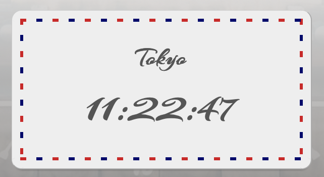

# NavigationBar-with-SlidingLine project
## About this project
Thanks for visiting this project page.

This project is created to show my skills in CSS and vanilla JavaScript.

Therefore, *I did not use any third-party libraries* to implement the feature of the navigation bar.

[Visit website](https://tomo-yoshi.github.io/NavigationBar-with-SlidingLine/)

## Functionality
### How to implement the sliding bar feature
The main feature of this project is the sliding bar which indicates a selected item. To implement the continuous motion, styles of the sliding bar are dynamically defined by JavaScript, not only by CSS.

    const alignSlideBar = (slideLineElement, targetElement) => {
        slideLineElement.style.width = window.getComputedStyle(targetElement).width;
        slideLineElement.style.left = targetElement.getBoundingClientRect().left + "px";
    }

The width and left position of the sliding bar is aligned to a selected item by the above function.

Styles of the sliding bar other than the width and left position are defined in a CSS file.

    .nav_slide_line{
        position: absolute;
        bottom: 0;
        height: 1.5px;
        background-color:#000000;
        -webkit-transition: all .3s ease;
        transition: all .3s ease;
    }

## Design
### Concept
Nowadays, it becomes difficult to travel abroad because of the pandemic. However, a lot of people are still eager to go across borders and see beautiful scenery. Therefore, my website displays a photo of a selected city as a background image to entertain visitors. I would like viewers to enjoy feeling like traveling around the famous cities.

### Clock

I have chosen an international mail as a design for the clock. Users can feel like receiving an international mail by selecting a new city. In addition, the design makes the mundane behavior of looking at a watch a little more enjoyable.

### Visual Effect
#### Why the card of the clock is spinning?

I have applied the spinning animation not only for fun but also for technical reasons.

A current time needs to be updated according to the selected city. And the update process takes a few hundred milliseconds. Therefore, I adopted the spinning animation instead of an ordinary "Loading" message.

## Resources
All photos used in this project are found on [Unsplash](https://unsplash.com/).

I really appreciate talented photographers.

* Photographers
    * [Carles Rabada](https://unsplash.com/@carlesrgm?utm_source=unsplash&utm_medium=referral&utm_content=creditCopyText)
    * [Patrick Tomasso](https://unsplash.com/@impatrickt?utm_source=unsplash&utm_medium=referral&utm_content=creditCopyText)
    * [Lucas Davies](https://unsplash.com/@lucas_davies?utm_source=unsplash&utm_medium=referral&utm_content=creditCopyText)
    * [Adrien Olichon](https://unsplash.com/@adrienolichon?utm_source=unsplash&utm_medium=referral&utm_content=creditCopyText)
    * [Clay Banks](https://unsplash.com/@claybanks?utm_source=unsplash&utm_medium=referral&utm_content=creditCopyText)
    * [Nic Low](https://unsplash.com/@niclow?utm_source=unsplash&utm_medium=referral&utm_content=creditCopyText)
    * [Tyler Duston](https://unsplash.com/@dustont12?utm_source=unsplash&utm_medium=referral&utm_content=creditCopyText)
